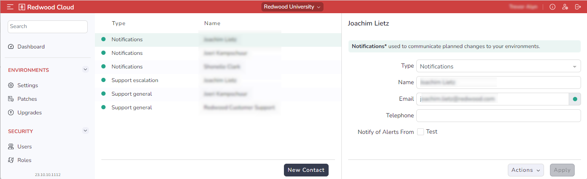

# Setting Up Notification Contacts

As part of the RunMyJobs SaaS offering, Redwood's 24/7 monitoring system can contact customers if certain scenarios occur that could affect the running of automated processes. The _Security \> Contacts_ screen in the Redwood Cloud Portal lets you specify who in your organization should be contacted when such support scenarios occur.

In most cases, Redwood support will create a support ticket before contacting such users directly.

The _Security \> Contacts_ screen is divided into two panes:

- The pane on the left lists the users to be contacted in case of various scenarios. In this pane, a red dot indicates an email addres that has not been confirmed, and a green dot indicates a confirmed email address.
- The pane on the right lets you modify the user details for the selected user.

To add a new contact, click New Content at the bottom of the left pane.

To edit an existing contact, select that contact on the left.

The detail view includes the following options.

- _Type_ dropdown list: Specifies what kind of notifications the selected user should be notified of. The options are as follows.
  - _Notifications_: This user will receive general, non-support-related messages related to the environment, such as usage data and upgrade announcements.
  - _Support general_ This user will serve as a general contact in case of critical issues,  situations where Redwood support notices that possible issues can occur, or the detection of unexpected / bad practice behavior.
  - _Support off-hours_ This user will serve as a technical contact in case of critical issues outside of business hours (based on the time zone where the customer contract was signed). This user will also be notified if immediate action is required by the customer to assure the environment will stay up and running. A general On-Call number can be added. If no off-hours contact is defined, the _Support general_ user will be contacted.
  - _Support escalation_ This user will be contacted if there are immediate issues and the _Support general_ and/or _Support off-hours_ users do not respond. This can be a coordinator, team lead, manager, or other user.
- _Name_: The user's name. You can have multiple contacts with the same name, as long as the other details are different.
- _Email_: The user's email address.
- _Telephone_: The user's phone number (optional). You must include a country code.
- _Notify of Alerts From_: Check each environment that the specified user should receive alerts for.

<Tip>
  You can also control who is notified of which types of alerts from the _Environments \> Settings_ screen. Select the environment tab at the top, then check the names of the desired users under _Notify of Alerts_.
</Tip>

<Note>
  You must have at least one _Notifications_ user and one _Support general_ user. These can be the same user.
</Note>