# Setting Up SSO with Microsoft Entra (Azure AD)

You can set up Single Sign-On (SSO) for RunMyJobs with all identity providers that both support SAML and offer a public metadata URL.

To do this with Azure Active Directory:

1. In Azure Active Directory, go to *Enterprise applications*, add a *New application*, and then click *Create your own application*.
    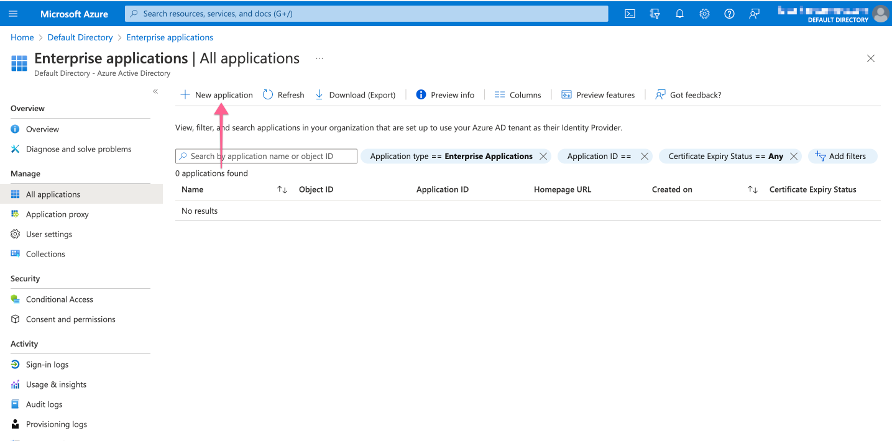
2. Set the app name you want, then check *Integrate any other application you don't find in the gallery* and click *Create*.
    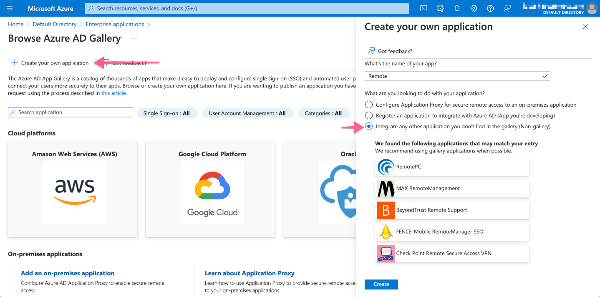
3. On the Applications *Overview* page, click *Set up single sign on*, then choose SAML as the single sign-on method.
    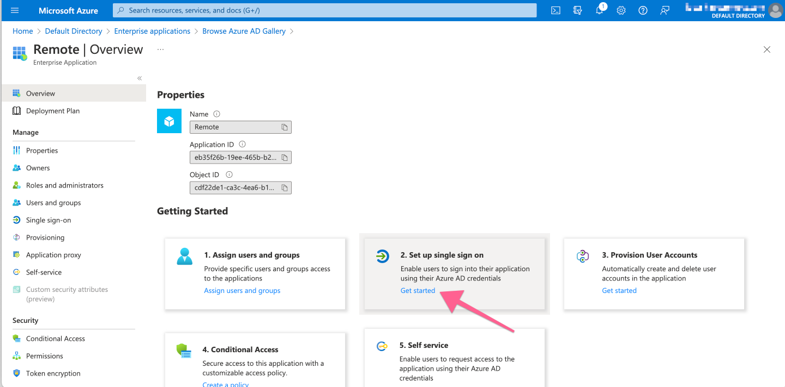
    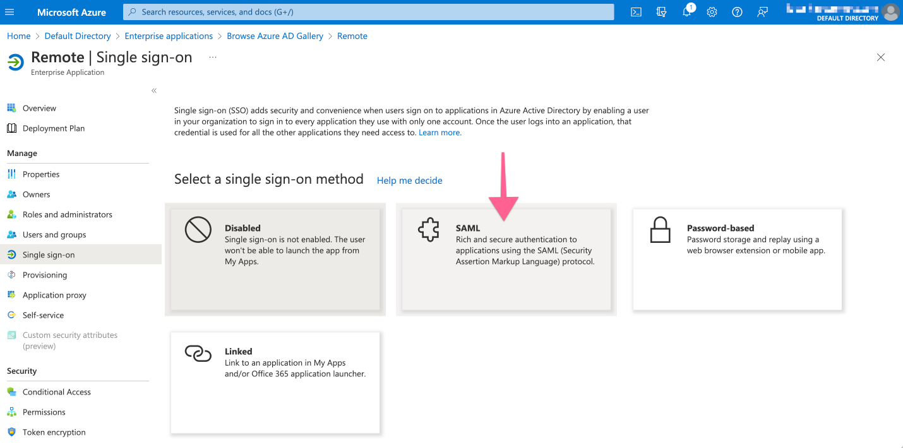
4. Redwood recommends that you upload the Redwood Cloud Portal metadata to auto prefill settings.
    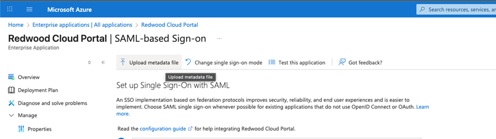
    Under *Basic SAML Configuration*, fill in the configuration generated on Remote’s *SSO Settings* page and then click *Save*.

    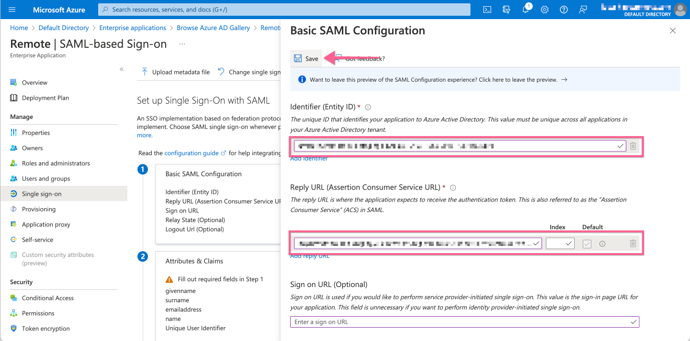

    !!! note
        `<SSOConfName>` is defined during the first step of Configuring SSO in Redwood SaaS portal (see screen shot below).

    Example: `https://portal.redwood.cloud/saml/module.php/saml/sp/saml2-acs.php/redwood-support-SSOTest`

    - Identifier (Entity ID):
        `redwood.cloud`
    - Reply URL (Assertion Consumer Service URL):
        `https://portal.redwood.cloud/saml/module.php/saml/sp/saml2-acs.php/<SSOConfName>`
    - Sign on URL (Target URL):
        `https://portal.redwood.cloud/sso/<SSOConfName>`
5. In the *Attributes & Claims* section, click *Edit*.
6. Click *Add a group claim*. When prompted, you can decide whether the group claim is always sent, or only for specific groups or assigned users. For more information, see the [Azure documentation](https://learn.microsoft.com/en-us/azure/active-directory/hybrid/connect/how-to-connect-fed-group-claims).
    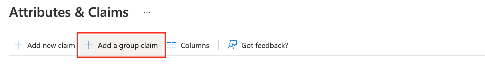
    For the groups Azure send the Object ID (GUID). This will later need to match SSO Access Group with Redwood.
    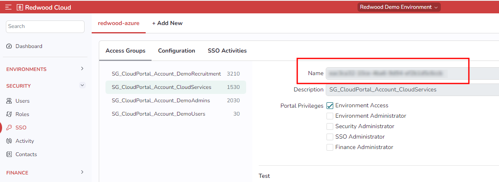
7. Click *Add a new claim* (if needed), so that at least the following Claims are available:

    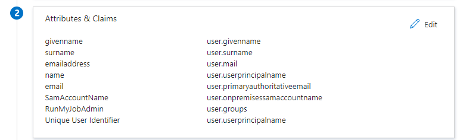
    

    - *email*: For example, `user.mail` or `user.primaryauthoritativeemail`.
    - *name which will be displayed*: For example, *user.displayname* or *user.userprincipalname*.
    - *groups*: For example, *user.groups* or `user.groups [ApplicationGroups]`.
8. In the *SAML Signing Certificate* and *Setup* sections, copy the App federation Metadata URL. This will be the Metadata URL requested in Step 1 when configuring SSO with RunMyJobs SaaS.
    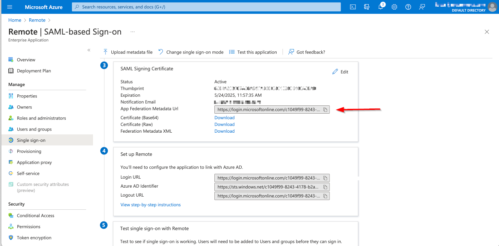
9. Click *Users and Groups* on the left, then assign the users or groups that should have access to RunMyJobs.
    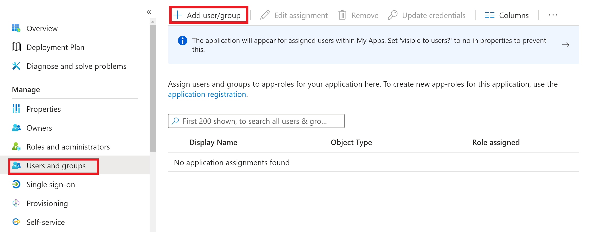
10. [Activate SSO with RunMyJobs](ssoconfiguration.md).
