Centralized user administration is key in organizations, both for ease of user management and from a security perspective. Best practice is to use Single Sign-On (SSO), providing end users with the convenience of only having to remember one set of credentials, and providing company administrators with a single point of management and a way to make sure their corporate password policies are enforced.

RunMyJobs can be configured to authenticate against an external security provider that supports the Security Assertion Markup Language (SAML 2.0) standard, as defined by [RFC 7522](https://datatracker.ietf.org/doc/html/rfc7522). SAML can be used either to directly integrate with (for example) your Active Directory domain controller using Active Directory Federation Services, or through online middleware providers that support SAML 2.0+ with a publicly accessible metadata URL.

When using SAML Authentication, Single Sign-On will be enabled, which means that machines that are part of the domain can transparently login to Redwood solutions.

## Single Sign-On Authentication via SAML

SAML (Security Assertion Markup Language) is an XML- and HTTP-based secure, industry-standard way to perform Single Sign-On (SSO) between online applications.

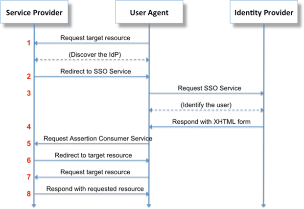

## Configuring Identity Provider (IdP) Claims/Tokens

RunMyJobs is compatible with all IdPs that both support SAML and offer a public metadata URL. Configuration of the IdP will need to be done by your IdP administrators, and how this is done varies from product to product. The configuration should be such that the minimal required user information for the SSO integration is returned, meaning the following items.

- Email address
- Display name
- Roles/groups the user is a member of

Before starting on the next section, ensure that your IdP team has done the following.

- Created at least the initial access group that will contain the user who will perform the SSO configuration in RunMyJobs.
- Added that user to that access group.

## Enabling Single Sign-On

### Required Portal Privileges

The following portal privileges should be taken into account when working on the SSO configuration.

**SSO Administrators**

- Can add/update/delete SSO configuration
- Can add/update/delete SSO access groups

**Security Administrators**

- Can update SSO access groups access

### Starting Single Sign-On Configuration

Log in to the Redwood Cloud Portal with an account that has the *SSO Administrator* role and navigate to *Security > SSO*.

You can create multiple SSO configurations if users from multiple Identity Providers are logging into your Redwood Cloud Portal account. You can have multiple SSO configurations live at once. You can also share SSO configurations across multiple Redwood accounts if needed, for example for partners with multiple accounts.

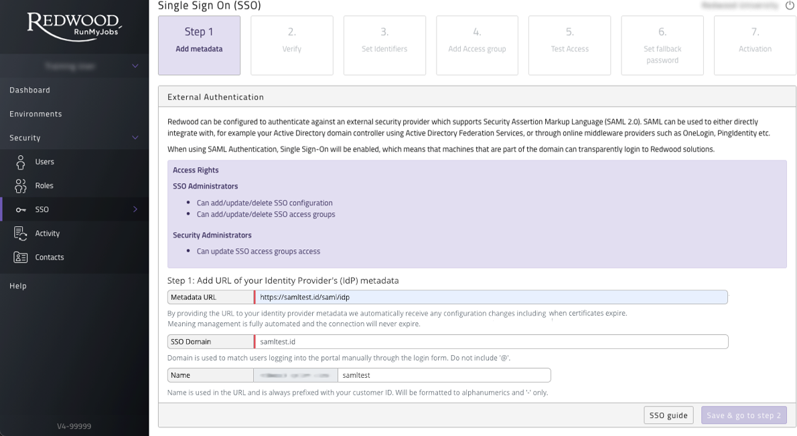

### Adding an Identity Provider (IdP)

The Metadata URL has to be obtained from your IdP, for example your Active Directory Federation Server (ADFS). Almost all IdP's have a public facing metadata URL, ask your IT department for this. Once you have obtained the Metadata URL, enter it in the input field and click submit. The portal will process the URL and process the metadata provided. If there are any problems the page will show them and explain what's needed.

Access to the Metadata URL will stay mandatory from portal.runmyfinance.cloud or portal.runmyjobs.cloud. This will assure constant availability as Redwood will then automatically renew the certificate and update changes done on the customer environment.

### Uploading Redwood metadata to IdP

Copy Redwood metadata URL and send to your IT department to upload to your IdP. **Claim rules for email, name & access groups also need to be set (see next step)**. We also suggest attaching this guide to the email you send to your IT department.

Some IdP's require an identity for RunMyJobs or Finance Automation, this will be `runmyfinance.cloud` or `runmyjobs.cloud`, respectively.

### Setup an IdP Claim rule

The Claim rules/transformation rules that **are required** to be set with the name "**NameID**" are:

- **Email** - This will be used as your username
- **DisplayName** - Used for first name last name (outside scroll area in Figure 3)
- **Groups** - Used to filter access groups to set correct access

Other rules can be sent over and will be ignored.

##### Example: ADFS setup

Figure 3 shows the setup for the NameID rule in ADFS.

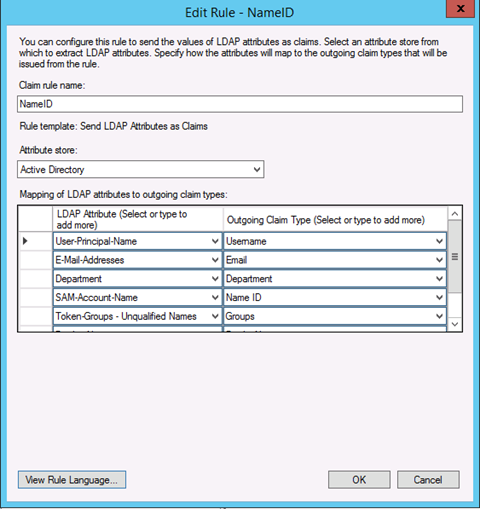

### Verify Setup

Once your IdP is configured you can verify by clicking 'Verify Authentication' button.

!!! note
    This only verifies the handshake between Redwood and your IdP is correct - not the claim rules setup.

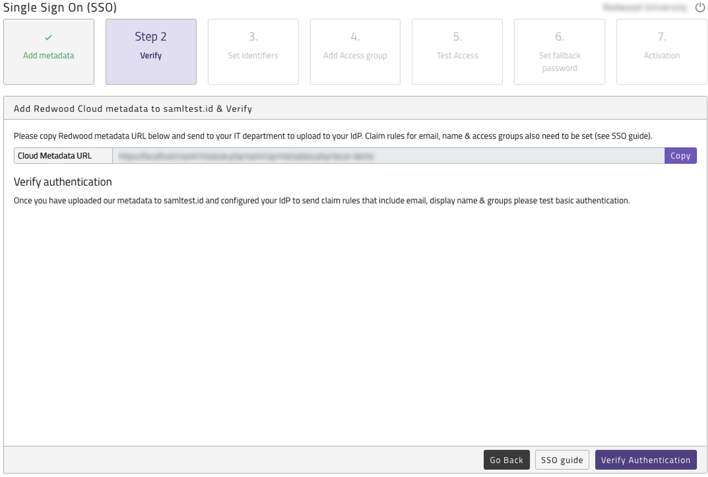

### Set Identifiers

Once claim rules are set on your IdP please click on the "Set identifiers" button shown in Figure 5.

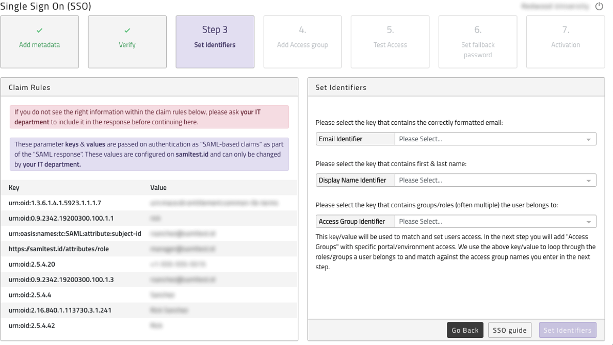

Figure 5 shows the full response from your IdP on the right-hand side. When blank, your IdP has **NOT** set any claim rules and **these are required**. Please review previous step and ask your IT team to set the claim rules as described.

On the left side is where you need to select which attributes passed from your IdP you want to use for each value. Select which attribute from the response you want to use to map to create users: email, name & access group. If a logical value is missing, you need to ask your IT department to add the claim rule for that value. You are able to re-update identifiers at any point after this save but all identifiers must be set.

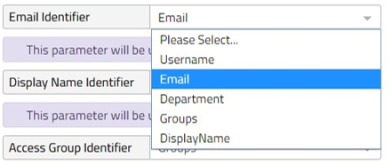

### Adding an Access Group

Once identifiers are set you need to add a new access group. You can add as many access groups as you require, and you need to select the Matching Method.

What are the matching methods?

- Merge Access (Default): If a user matches multiple access groups all will be linked to the user. We then build the users access by merging all groups access levels. If multiple groups have access set for the same environment the group with the highest access value that is assigned to you will be taken. For example, if you match two groups, one with 'Operator' access and one with 'Administrator' you will be granted 'Administrator' access.
- Best Match: If a user matches multiple access groups the access group with highest access will be used and the other groups will be ignored. The order of access groups is determined on the Total Access Value a Group represents. The access value is based on the sum of access granted to that Group. The Group with the highest access value that is assigned to you will be taken.
    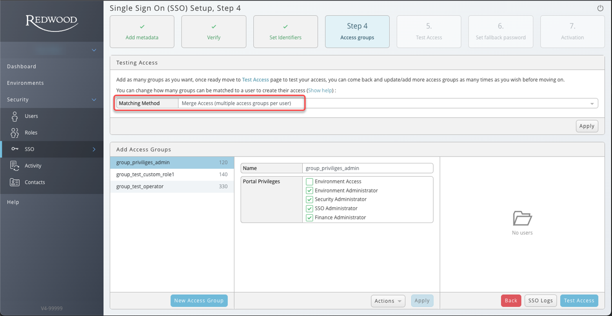

The 'name' value must match one of the items passed in the access group identifier.

For example: We have set our access group identifier to "Groups" ADFS passes a list of values set per user: ['Domain Users','RMJ_Users','SG_IT',....] for this example we created a ADFS group 'RMJ_Users' and will match this one to create the correct level of access for those users. You can choose to use current groups set up in your IdP (for example department groups) but we recommend creating new groups for each level of access you wish to grant to your users.

Once this is done you can "check" the relevant Portal Privileges for this group.

All users who match this access group will have the exact same access. Access level can only be changed at group level and all users will be updated to match.

!!! note
    If a user matches multiple access groups the access group with highest access will be used and the other groups will be ignored. We show which users belong to which access group and which access group controls a user's access on the relevant pages.

The order of access groups is determined on the Total Access Value a Group represents. The access value is based on the sum of access granted to that Group. The Group with the highest access value that is assigned to you will be taken.

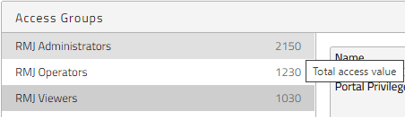

Single Sign On (SSO) also controls custom role access. When adding or updating SSO access groups you will see the option to select any active custom roles you have created. If selected any users controlled by the access group will be added to the custom role. You can add multiple custom roles to an access group and a custom role can have multiple access groups linked to it.

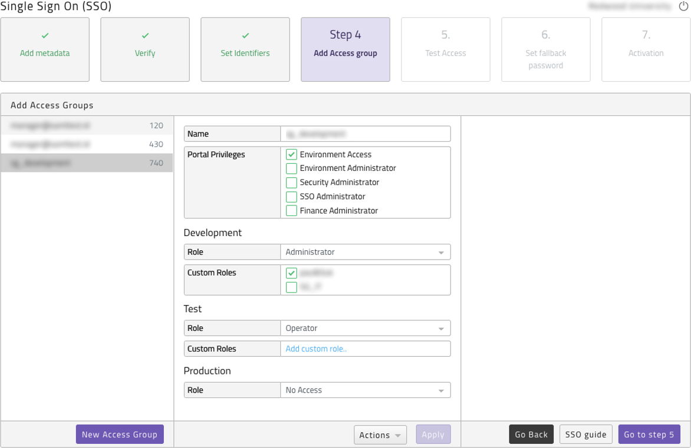

### Test Access

Once access groups are added you are required to test access, please click on Step 5 - Test Access button - Activating SSO is NOT required for the test. Please log into your IdP with the user you wish to test. You will automatically return to the test page where you will see the response from the IdP, the best match access group found and the resulting user that would be created. Please note no actual user has been created as this is solely a test.

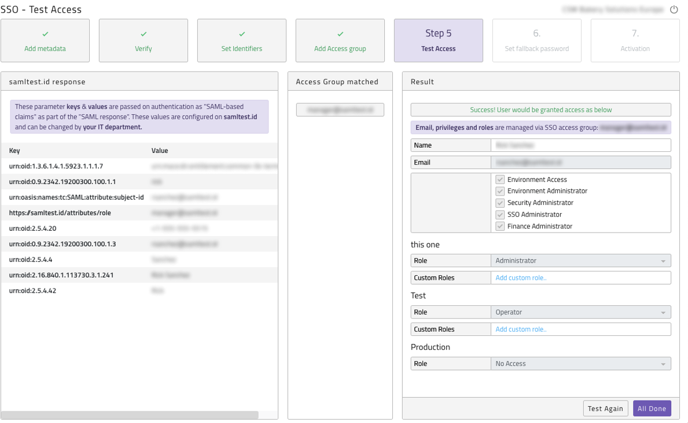

Once you have tested a user with SSO Administrator access and are happy with the results, press the *All Done* button.
If you do not see a result similar to the screenshot above you need to review your configuration, instructions on the page will explain what you need to do. Press the Update access group button. Please review environment access level matches what you expect. The access groups work on a one-to-one best match.

!!! tip
    If users have access issues after activation, simply login with the SSO Administrator user to change the configuration as needed.

### Set fallback password

We recommend you set a fallback password that can be used if your IdP ever goes down and store this securely somewhere, accessible to authorized personnel, only.

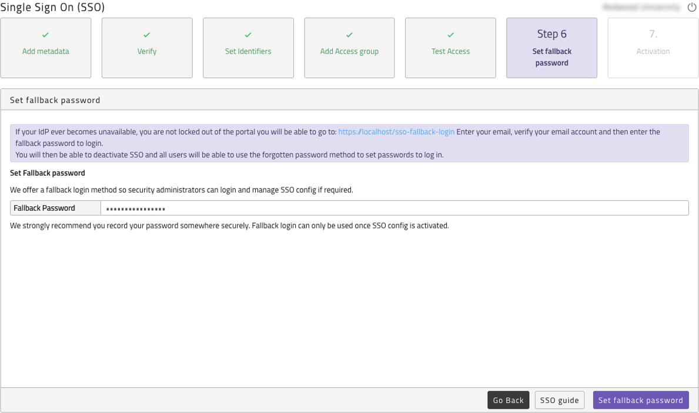

### Activating SSO configuration

Within the Activation section you will be presented with information regarding the process and the terms of activating SSO, please read through them and tick the Activate checkbox. Then click Activate. SSO will now be active.

!!! note
    Any non-SSO users that are linked to the domain (non-system users that you created in the portal prior to having an SSO configuration, that are not SSO Administrators), will be deleted upon SSO activation. Any deleted users will be re-created automatically once they login, via their company SSO.

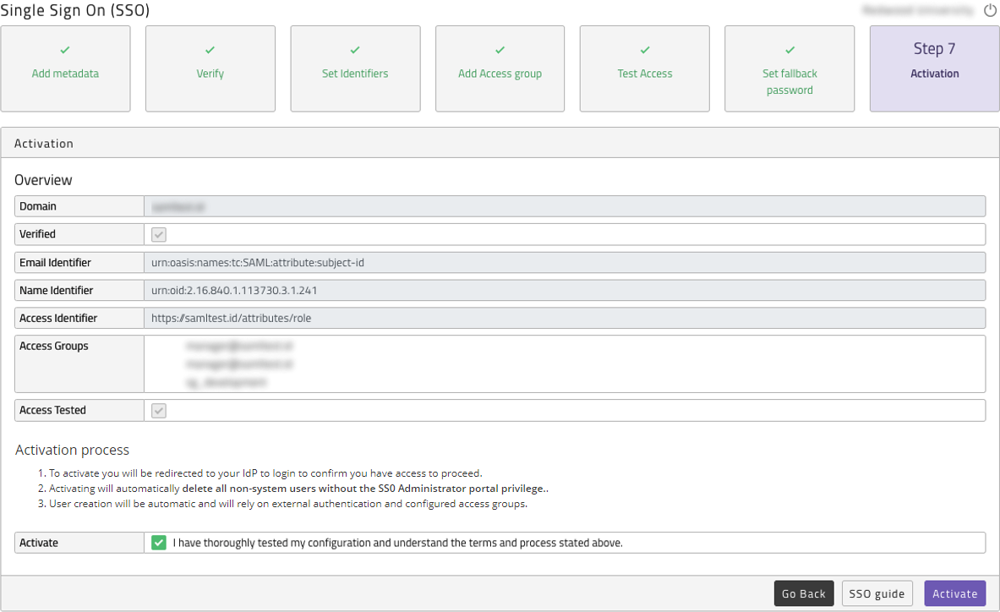

### Deactivate, reactivate or delete SSO configuration

Once an SSO configuration has been activated, you do have the ability to deactivate. To do so uncheck the Active checkbox and press the Apply button. All users will then be required to use the forgotten password method to set their individual passwords.

Once deactivated you can either re-activate the configuration which does require SSO with your IdP to be working as we test access before activation. Or you can delete the configuration and start again. This second option will remove all access groups and all users linked to those groups except for SSO Administrators.

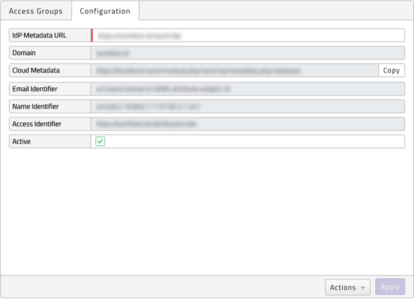

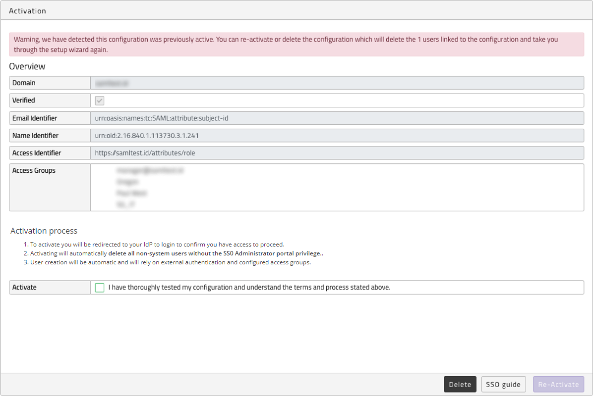

### Fallback Login

If your IdP becomes unavailable, you are not locked out of the portal you need to go to:

[https://portal.runmyjobs.cloud/sso-fallback-login](https://portal.runmyjobs.cloud/sso-fallback-login)[https://portal.runmyfinance.cloud/sso-fallback-login](https://portal.runmyfinance.cloud/sso-fallback-login)

Enter your email. A new verify code will be emailed to you. You need to enter the verification number and then enter the fallback password to login. You will then be able to deactivate SSO and all users will be able to use the forgotten password method to set passwords to log in.

If you do not know your fallback password raise a support ticket and they will be able to reset it for you.

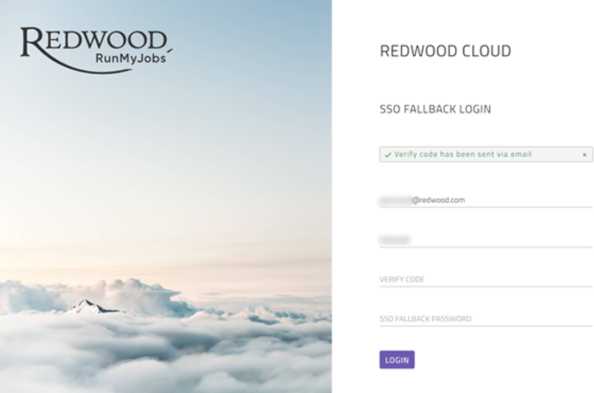

## Adding additional SSO configurations

Accounts on the portals can now have multiple SSO configurations per account. This allows you to add additional identity providers from other parts of their organizations that use separate domains.

This new feature can also be used to migrate from one identity provider to another by allowing you to fully configure and test the new configuration before switching - even if they both use the same domain.

- Rules - There can only be one configuration active per domain but multiple domains are allowed.
- Security - You cannot activate a configuration for a domain that is already active. You must first deactivate the previous configuration - only the owner of the active configuration can do this.
    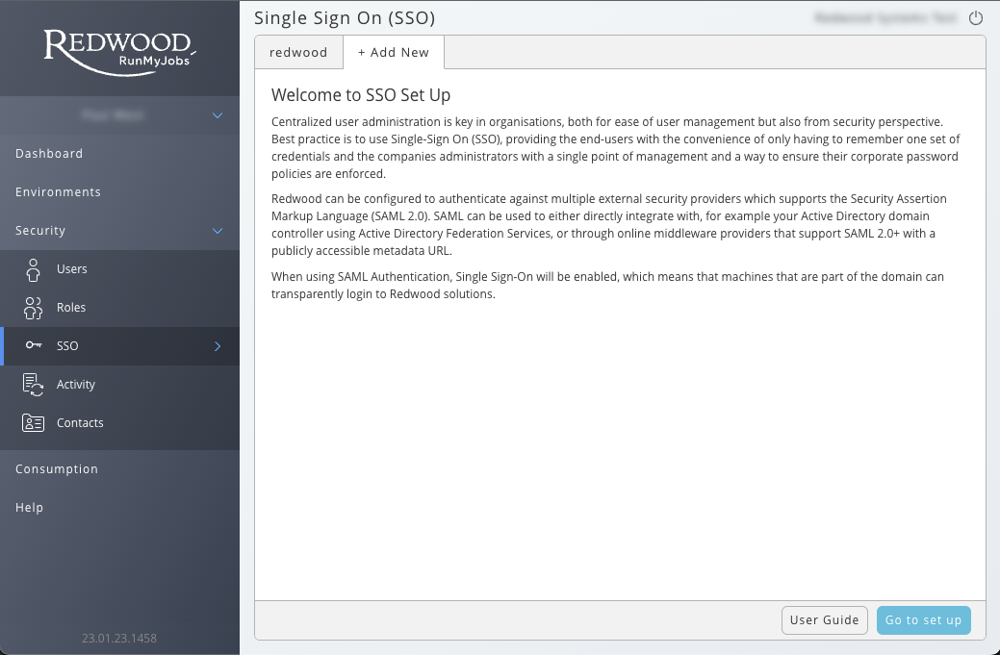

### Recommendations

- A user should belong to one IdP only.
- An IdP/SSO configuration should not be related or linked to a single environment but to the whole account.
- Access groups should control environment access, Example: `redwood-batch-groups-dev`, `redwood-batch-groups-test`, `redwood-batch-groups-prod`
