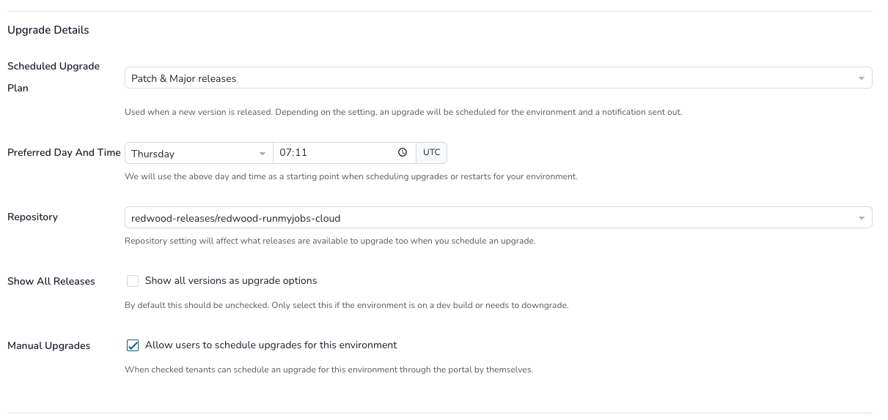

# Upgrades Screen

Redwood strives for optimum reliability and security in its SaaS environments. Consequently, upgrades are mandatory, although patch-level upgrades are optional for Finance Automation environments. Upgrades are announced via Message of the Day in the SaaS dashboard; *General – Notifications/Reports* contacts *(Security > Contacts)* will be informed via email. For RunMyJobs, all three environments (development, test, production) must be upgraded following a precise calendar, based on the day of the release.

!!! note
    Finance Automation automatic upgrades are suspended for the time being.

## Major and Patch Releases

Major and Patch releases consist of new features, new supported systems, and security and stability enhancements. They can be scheduled as the customer desires, within the boundaries described below.

| Environment | Scheduled (default start from) | Schedule Window |
| --- | --- | --- |
| Development | 1 week | 2 weeks |
| Test | 2 weeks | 4 weeks |
| Production | 4 weeks | 10 weeks |

!!! note
    The allowed upgrade window for an environment is from the time the Patch or Major release is released until the maximum schedule window expires.

## Preferred Day and Time

The **Preferred Day and Time** setting allows you to choose a regular upgrade window for each environment. This window is used to schedule **planned upgrades and maintenance**.

## How this setting is used

We use your selected day and time to schedule **all automated events** for the environment, helping ensure upgrades happen at a time that works best for your team.

### What you can expect

You will always:

Be notified when a new upgrade or maintenance event is scheduled

Have the ability to manually reschedule events whenever needed

### Advance notice

All upgrades and maintenance are scheduled **several weeks in advance**, giving you ample time to review, prepare, or adjust the schedule if required.

### Environment upgrade order

Upgrades are always performed in the following order, with adequate time between each step:

1. **Development**
2. **Test**
3. **Production**

This staged approach helps minimize risk and ensures changes are validated before reaching production.
