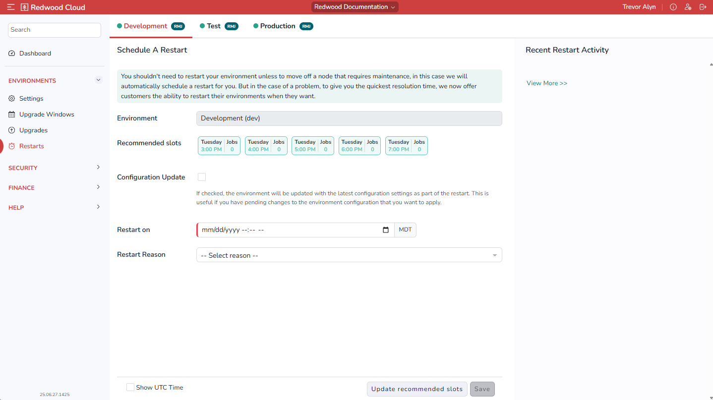

# Restarts Screen

The _Restarts_ screen lets you restart your environments.

On this screen, your environments display as a horizontal row of tabs at the top.

## Schedule a Restart Area

The _Schedule A Restart_ area lets you schedule a manual restart of the selected environment.

The controls in this area are as follows:

- _Environment_: Displays the name of the environment.
- _Recommended slots_: To perform the restart at a system-recommended day and time, select one of the _Recommended slots_ options. These options are determined based on the least busy time between all of your production and non-production sites.
- _Configuration Update_: If this is checked, the environment will be updated with the latest configuration settings as part of the restart. This is useful if you have pending changes to the environment configuration that you want to apply.
- _Restart on_: Lets you specify a specific desired restart date and time.
- _Restart Reason_: Lets you indicate a reason for the restart. If you choose _Other_, you can manually enter a description. HOW IS THIS USED? WHAT IS IT FOR?
- _Update recommended slots_: Click this button to refresh the list of recommended upgrade slots.
- _Save_: Save changes. You must click this button to schedule the restart.

## Recent Restart Activity Area

This area lets you view recent restart activity.