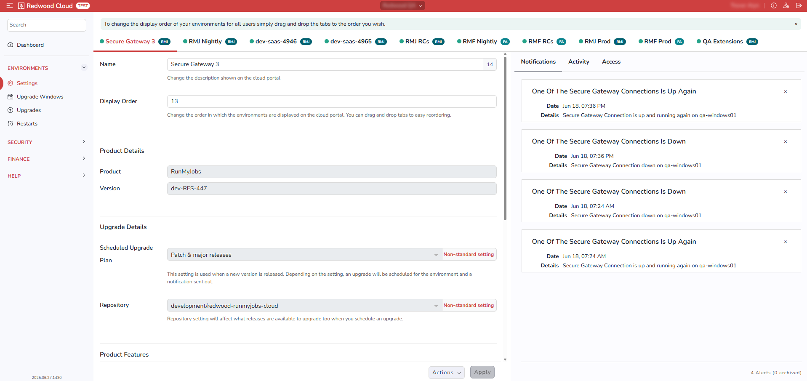

The *Settings* screen (*Environments* > *Settings*) lets you configure settings for each of your environments.

On this screen, your environments are displayed as tabs across the top.

The area on the right provides access to Notifications, lets you view recent activity for each environment, and indicates which Users have what kind of access to the environment.

## Name and Display Order

The Name field lets you change the name of the environment as it displays in the Redwood Cloud Portal.

The *Display Order* field lets you change the order in which environments display on the [*Dashboard* screen](../dashboardscreen). Environments with lower *Display Order* numbers display before environments with higher numbers. You can also control the order of the environments by dragging and dropping the tabs on this screen.

!!! note
    If you reorder the tabs via drag-and-drop, the *Display Order* field does not update until the site is reloadced.

## Support Details Section

The *Support Access* area lets you specify whether Redwood Support personnel in various regions can have read-only access to each environment. This helps Redwood to troubleshoot and fix problems more quickly and efficiently.

If you have 24-hour support, check all of these regions.

If you want to allow Redwood developers to have read-only access to the environment, check *Extended*.

## Notification Details Section

The *Notifications* area lets you specify which kinds of Notifications you want to receive in the Redwood Cloud Portal.

The *Send Notifications To* area lets you specify which Users receive the selected Notifications.

## Product Details Section

The *Product Details* section displays the environment's product name and version number.

## Upgrade Details Section

The *Upgrade Details* section lets you select an upgrade plan and chooses which repository is used for upgrades.

### Scheduled Upgrade Plan {#ScheduledUpgradePlan}

The options for *Scheduled Upgrade Plan* are:

- *Manual Upgrade*: You must manually schedule all upgrades.
- *Scheduled Upgrade (patch & major releases)*: Upgrades will be scheduled for all new releases, per the selected [upgrade window](upgradewindowsscreen).
- *Immediate*: An upgrade will occur immediately.
- *Scheduled Upgrade (major releases only)*: Upgrades will be scheduled only for major releases, per the selected upgrade window.
- *Scheduled upgrade (patch releases only)*: Upgrades will be scheduled only for patch releases, per the selected upgrade window.

### Repository

The options for *Repository* are WHAT? HOW SHOULD THE CUSTOMER CHOOSE?

## Product Features Section

The *Product Features* section lets you specify which add-on features the environment should use. If you want to add one of these add-ons, DO WHAT?

## Service Details Section

The *Service Details* section DISPLAYS? LETS YOU UPDATE? various aspects of the environment.

- *Type*: *Production* or *Non-Production*.
- *Account ID*: WHAT IS THIS FOR?
- *Subdomain*: HOW DOES THIS WORK?
- *Environment ID*: WHAT IS THIS?
- *Region*: WHAT IS THIS?
- *URL*: The primary URL for the environment.
