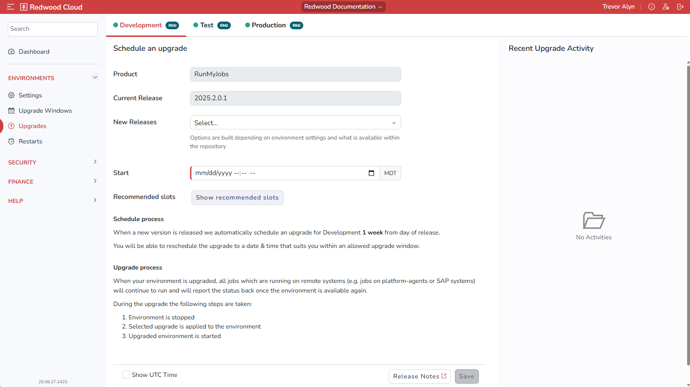

# Upgrades Screen

The Upgrades screen lets you schedule upgrades for each environment. You can use this screen if you prefer to upgrade your environments manually rather than using one of the *[Scheduled Upgrade Plan](settingsscreen.md#ScheduledUpgradePlan)* options in the [*Settings* screen](settingsscreen.md).

On this screen, your environments display as a horizontal row of tabs at the top.

## Schedule an Upgrade Area

The controls in this area are as follows:

- *Product*: Displays the name of the product installed in this environment.
- *Current Release*: Displays the version of the currently installed product.
- *New Releases*: Lets you choose which release you want to upgrade to.
- *Start*: Lets you specify a desired upgrade date and time.
- *Recommended slots*: To perform the upgrade at a system-recommended day and time, click *See recommended slots* and then select one of the *Recommended slots* options. These options are determined based on the least busy time between all of your production and non-production sites.
- *Show UTC Time*: Lets you specify that the upgrade time should display in the UTC time zone.
- *Release Notes*: Displays Release Notes for recent versions of the product.
- *Update recommended slots*: Click this button to refresh the list of recommended upgrade slots.
- *Save*: Save changes. You must click this button to schedule the upgrade.

## Recent Upgrade Activity Area

This area displays information about recent upgrades (if any).
