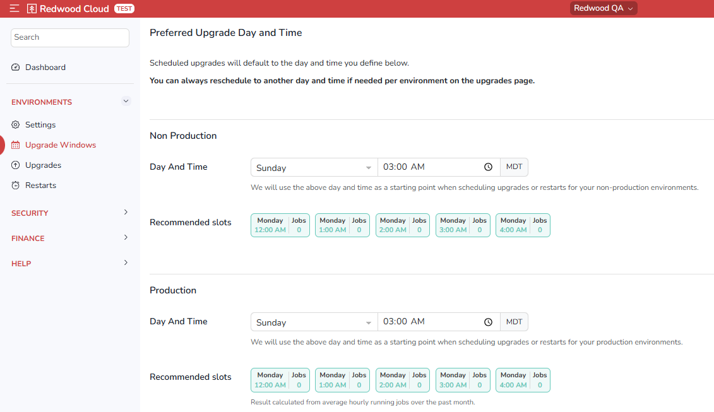

# Upgrade Windows Screen

The Redwood Cloud Portal lets you [schedule upgrades](../../upgrades/schedulingupgrades) for a time that is convenient for you. If you have multiple environments, you can stagger upgrades rather than upgrading all of them at once.

The *Upgrade Windows* screen lets you specify when you prefer to upgrade each environment. To view this screen, navigate to *Environments > Upgrade Windows*. A vertical list of your environments displays.

There are two ways to specify a desired upgrade day and time for an environment:

- Use the *Day And Time* controls to specify a day and approximate time for the upgrade.
- Click one of the *Recommended slots* options. These options are determined based on the least busy time between all of your production and non-production sites.

!!! note
    The default day and time is Sunday at 3 am UTC. However, Redwood recommends setting or selecting a different day and/or time, because upgrades requested at the default day and time must be spread out over time, and thus may not occur when you expect them to.
