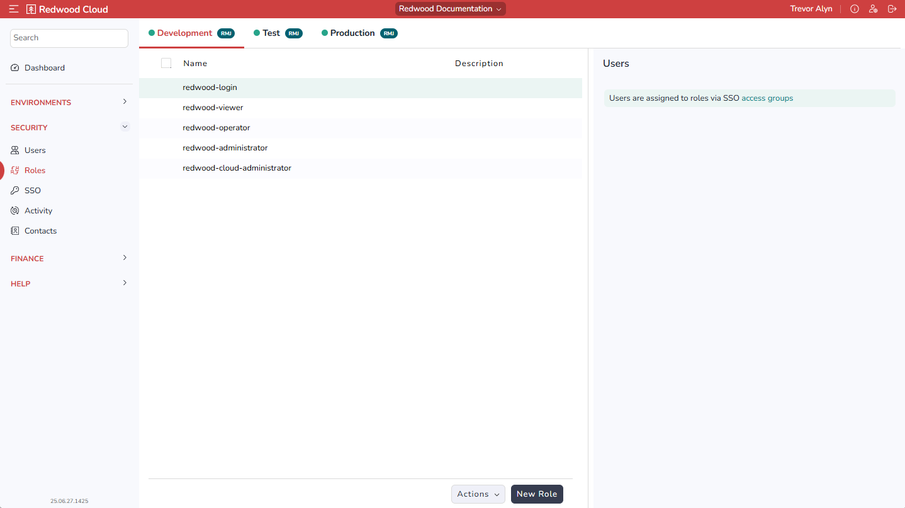

The Roles screen lets you view built-in Roles and create custom Roles.

On this screen, your environments display as a horizontal row of tabs at the top.

HOW DO YOU USE THIS SCREEN?

### Users Area

HOW DO YOU USE THIS AREA?

### Actions Menu

The *Actions* menu at the bottom includes the following options:

- *Import from CSV*: Lets you import Roles in CSV format. WHAT IS THE SPECIFIC FORMAT?
- *Copy to Test*: Lets you copy the selected Roles to the Test environment.
- *Copy to Production*: Lets you copy the selected Roles to the Production environment. ARE THERE MORE OPTIONS IF THERE ARE MORE ENVIRONMENTS?
- *Delete*: Lets you delete the selected Roles.

### New Role Button

ARE ROLES CREATED HERE CONSIDERED "CUSTOM ROLES"?

The *New Role* button at the bottom displays the New Role area, which includes the following options:

- *Name*: The name of the Role.
- *Description*: A short description of the Role.
- *Documentation*: A longer description of the Role.
- *Environments*: Check the environments where you want this Role to be available.
- *Save* button: You must click *Save* to save a new role.
