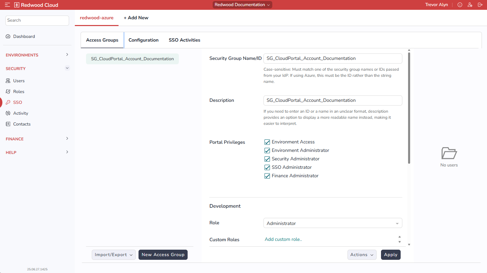

# SSO Screen

The SSO screen lets you connect the product with a SAML 2.0 external identity provider.

The tabs at the top represent connected SSO providers. The *Add New* tab lets you add a new identity provider.

!!! note
    For information on adding an SSO configuration, see [SSO Configuration](../../ssoconfiguration/ssoconfiguration).

The remaining UI lets you set up access groups, configure the SSO connection, and view SSO activity.

## Access Groups Tab

The *Access Groups* tab lets you create and configure access groups.

The left side of this tab displays the list of access groups for the selected SSO provider.

The right side displays details about the selected access group, both in general and within your various environments. It contains the following controls.

- *Security Group Name/ID*: This case-sensitive value must match one of the security group names or IDs passed from your identity provider. IS "SECURITY GROUP" THE SAME THING AS "ACCESS GROUP"?

    !!! note
        If you are using Azure, this must be the security group ID, rather than the security group name.
- *Description*: A human-readable description of the security group.
- *Portal Privileges*: Lets you specify [portal privileges](../../usersandroles/portalprivileges) for the selected access group.

Below this is a section for each of your environments. These sections include the following controls:

- *Role*: A built-in Role to assign to the access group.
- *Custom Roles*: One or more [custom Roles](../../usersandroles/customroles) to assign to the access group. You can click *Add custom role* to add a custom Role.

### Actions Menu

The *Actions* menu at the bottom includes the following options:

- *Delete*: Deletes the selected access group.
- *Help*: DOES NOT SEEM TO DO ANYTHING

## Configuration Tab

WHEN WOULD THIS BE AVAILABLE AND WHAT DOES IT DO?

## SSO Activities Tab

Click the *SSO Activities* tab to view the *Activity* screen for the selected SSO provider.
