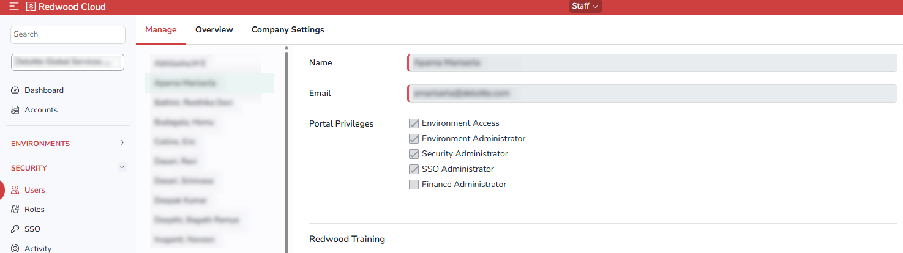
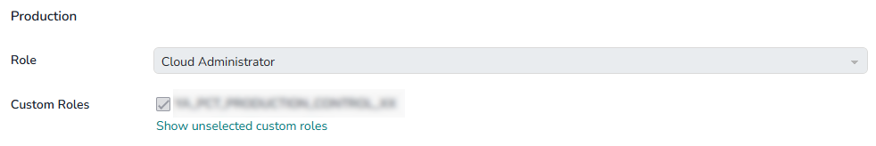

# Users Screen

The *Users* screen lets you view and configure all Users that are registered for your organization. It includes the following tabs:

- [Manage](#Manage) tab
- [Overview](#Overview) tab
- [Company Settings](#Company) tab

It also includes a [Filter](#Filter) area for filtering the results shown in these tabs.

## Manage Tab {#Manage}

The *Manage* tab lists all Users on the left, and allows you to configure whichever User is selected. You can specify the User's name and email address and set the User's [portal privileges](../../usersandroles/portalprivileges.md).

Below the first section, there is a list of the installed environments. For each environment, you can choose a [Role](rolesscreen.md) for the selected User.

If the environment includes [custom Roles](../../usersandroles/customroles.md), you can assign them to the selected User. If a custom Role is already selected, it displays with a checked check box. If there are unselected custom Roles, you can display them by clicking *Show unselected custom roles*.

### Actions Menu

The *Actions* menu at the bottom of the *Manage* tab includes the following options:

- *Resend welcome email*: Resends the welcome email that is sent to a User's email address when their account is initially created.
- *Resend verify email*: Resends the verification email that is sent to a User's email address to verify that the email address is correct.
- *View activity*: Displays the Activity screen for the selected User.
- *Delete*: Deletes the User.

## Overview Tab {#Overview}

The Overview tab lists all Users and allows you to view the following information about each.

- Name.
- Email.
-  (Environment Access). A green dot indicate s WHAT? WHAT ARE THE OTHER POSSIBLE STATES?
- The Roles that the User has in each environment. A separate column is shown for each environment.
- : Shows a green dot if the User is an Environment Administrator.
- : Shows a green dot if the User is a Security Administrator.
- : Shows a green dot if the User is an SSO Administrator.
- : Shows a green dot if the User is a Finance Administrator.

### Actions Menu

The *Actions* menu at the bottom of the *Overview* tab includes the following options:

- *Export (monthly)*: WHAT DOES THIS DO?
- *Export (quarterly)*: WHAT DOES THIS DO?
- *Export now*: WHAT DOES THIS DO?
- *Manage scheduled exports*: WHAT DOES THIS DO?

## Company Settings Tab {#Company}

The Company Settings tab lets you set the default timeout for your organization. You can override this timeout HOW? WHERE?. If you change this setting, you must click *Save* at the bottom.

## Filter Area {#Filter}

To display controls that let you filter and search the data displayed on the selected tab, click  at top right.
