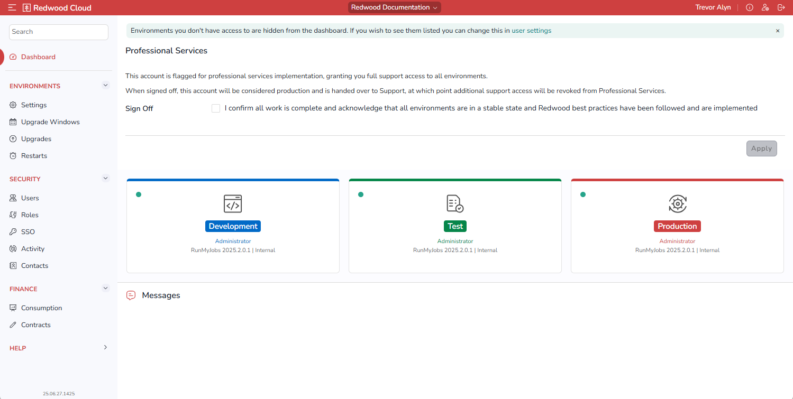

The *Dashboard* screen displays all of the environments that the logged-in User has access to, in the order specified on the [*Settings* screen](environments/settingsscreen). It also includes a *Messages* area, where you can DO WHAT?

