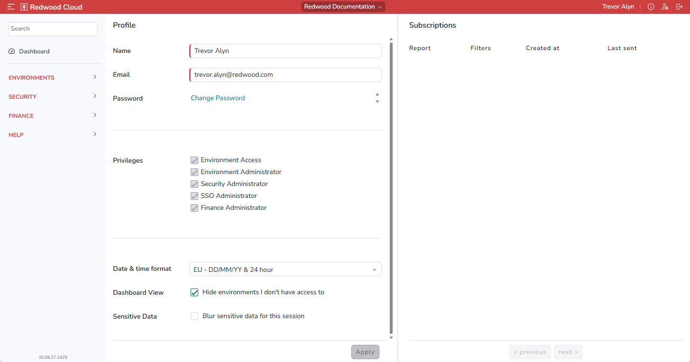

The *User Settings* screen lets you configure various options for the active user. To display the *User Settings* screen, click  at the upper right.

## Profile Area

The controls in the *Profile* area are as follows.

- *Name*: Lets you enter your name as you want it to display at top right.
- *Email*: Lets you enter your email address.
- *Password*: Lets you change your Redwood Cloud Portal password.
- *Privileges*: Lets you see which privileges are applied to your User account.
- *Date & time format*: Lets you specify how dates and times display in the Redwood Cloud Portal.
- *Dashboard View*: Lets you hide environments that you do not have access to on the Dashboard screen.
- *Sensitive Data*: Lets you blur any sensitive data displayed on the screen for the active session.

!!! tip
    If you make any changes to these settings, you must click *Apply* at the bottom to save them.

## Subscriptions Area

WHAT IS THIS?
