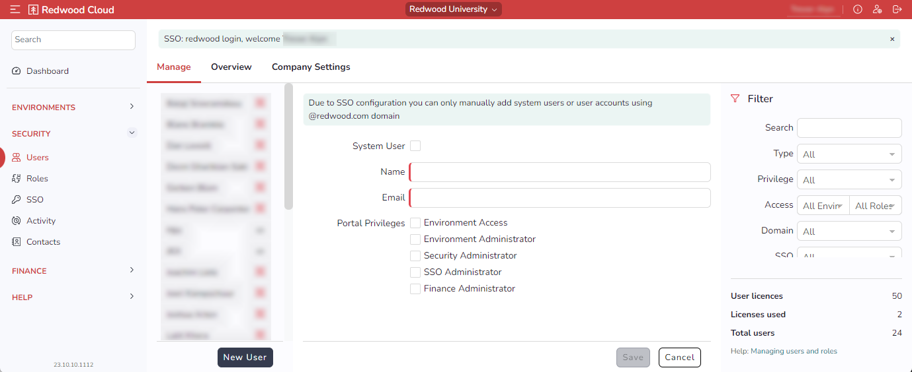
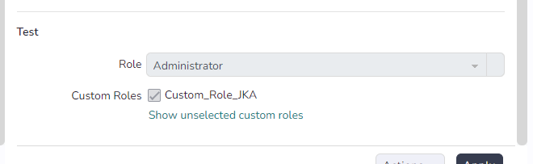

# Creating Users

To create a new user:

1. Navigate to *Security  > Users*.
    
2. Click *New User* at the bottom.
3. If the User should be a [System User](systemusers.md), check *System User*.
4. Enter the User's name in user-readable format in the *Name* field.
5. Enter the User's email address in the *Email* field.
6. Set the user's [portal privileges](portalprivileges.md) by checking the appropriate boxes under *Portal Privileges*.
7. Below the *Portal Privileges* controls, there is a section for each environment. Each environment has a *Role* dropdown list. Select an option for each environment.
    

    !!! note
        By default, customers will get access to three environments: "Development", "Test", and "Production". (Note that the names of these environments can be changed by Environment Administrator users if required). Additional environments can be purchased when necessary; contact your Account Manager for more information.

    - *No Access*: A user with this role in a given environment will not see a *Connect* button for that environment in the dashboard.
    - *Login*: A user with this role in a given environment can connect, but can view or interact with objects only via custom roles.
    - *Viewer*: A user with this role has view-only access the environment. Such users cannot submit processes, nor can they create and edit objects.
    - *Operator*: A user with this role has access to functions required for day-to-day operations of the environment. Such users can submit and monitor processes, and they can stop and start connections to managed environments. However, they cannot create or edit objects.
    - *Business*:  A user with this role can create business-user-specific screens.
    - *Administrator*: A user with this role has full access to administer the environment. Such users can create, edit, and delete objects; monitor and submit processes; stop and start Queues/connections; create connections to managed systems; and administer object-level security (except for Secure Gateway configuration on the [UNRESOLVED: General.Job] Server).
    - *Cloud Administrator*: A user with this role has the same access as the Administrator, plus the ability to manage Secure Gateway configuration.
8. If a user requires a [custom Role](customroles.md) in a given environment, check the custom Role for that environment.
9. Click *Save*.

!!! note
    Changing a user's role can have an impact on scheduled workload. For example, if a user with *Operator* access submits a recurring process, and that user is then
    changed to a *Viewer*, the recurring process will fail. This is because at execution time, RunMyJobs will attempt to execute the process using the privileges of the user that submitted the process. If you experience this, use the *System_ChangeOwner*[UNRESOLVED: General.Job] Definition to change the owner of the recurrence. Perform a dry run first to ensure you have selected the correct objects to update.
