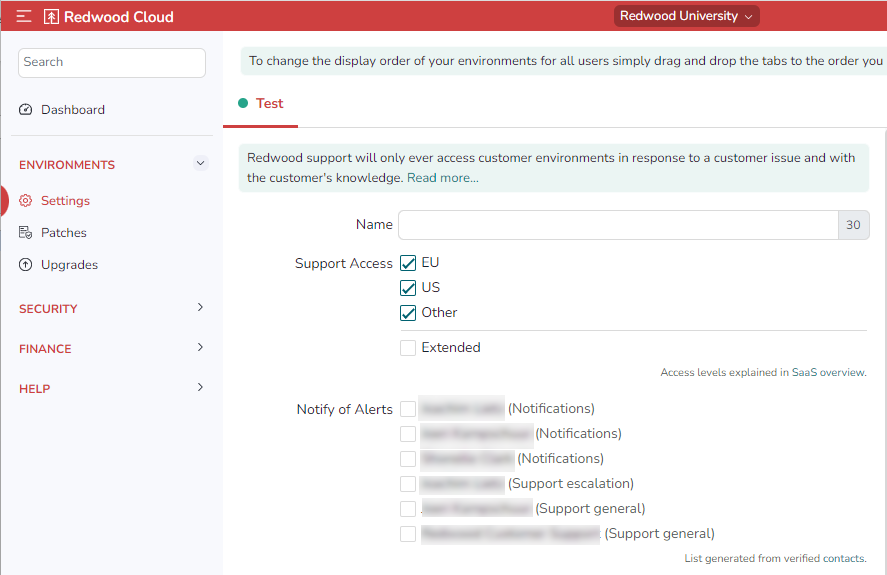

Redwood employees with the Staff Support Role can obtain read-only access to customer environments, controlled via Redwood SSO security groups.

By default, Redwood support has read-only access to customer environments for support issues. All connections by Redwood Support are tracked and visible in your activity audit, including the ticket number and reason for connection. 

To modify this access, you must have the Environment Administrator portal privilege.

To grant support access to a Redwood Cloud Portal User:

1. Navigate to *Environments > Settings*.
2. Click the tab at the top for the target environment.
    
3. To allow or disallow Redwood access for the available support regions, go to *Support Access* and check or uncheck *EU*, *US*, and/or *Other*.
4. To allow extended access, which allows Redwood support staff to extend support access to Redwood developers, check *Extended.*

Even if none of these above boxes is checked, you can create dummy users to allow Redwood support access to your environment, or simply add Redwood support personnel as regular users using their `@redwood.com` email addresses.
