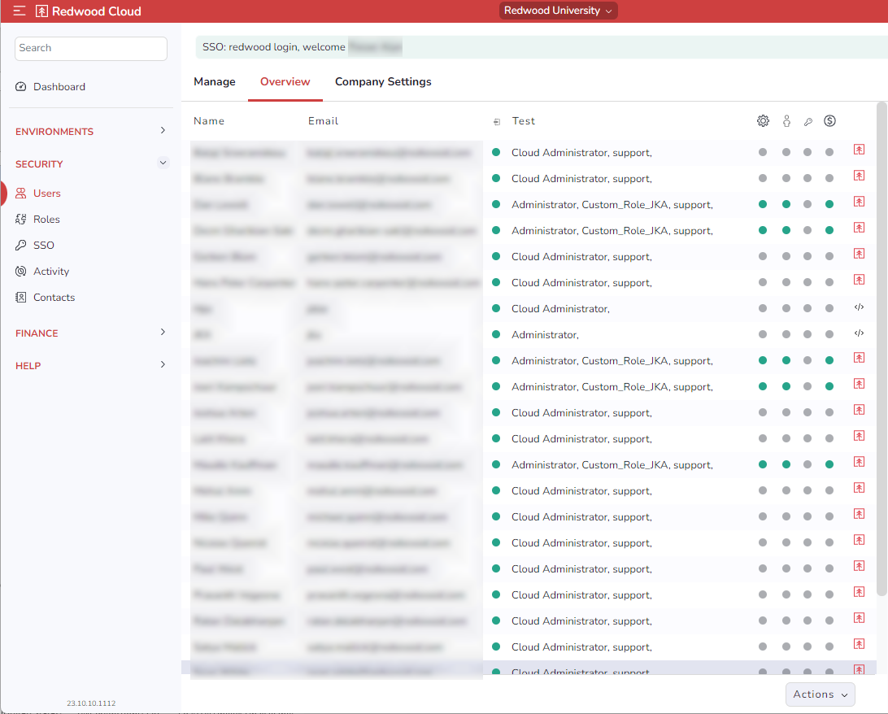

# Viewing User Summaries

To view a summary of all users, including their name, email, and role in each environment, navigate to *Security > Users* and then click the *Overview* tab at the top. This screen also shows which users are counted against your license.

!!! note
    If a Redwood icon displays for a user, that means the user is a Redwood user, and as such is not counted toward the license.

To export this information, choose an option from the *Actions* dropdown list at the bottom. The options are as follows:

- *Export (monthly)*
- *Export (quarterly)*
- *Export now*
- *Manage scheduled exports*
